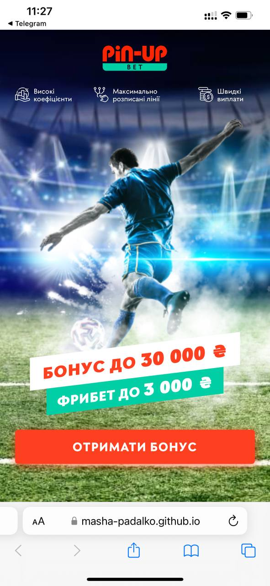
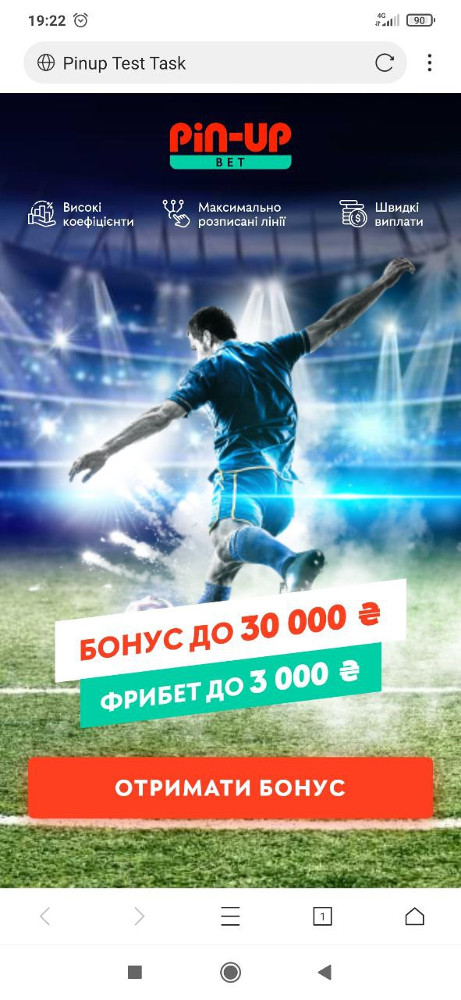

<h1>Test Task Padalko Mariia</h1>

<h2>Github pages:</h2>
<a href="https://masha-padalko.github.io/pinup/" target="_blank">https://masha-padalko.github.io/pinup/</a>
<h2>Project Setup:</h2>

npm install

gulp serve

<h2>Recommended Node version</h2>

https://nodejs.org/download/release/v14.18.0/

<h2>Comments:</h2>
<ul>
<li>Mobile first approach</li>
<li>All svg were compressed by <a href="https://jakearchibald.github.io/svgomg/" target="_blank">SVGOMG</a> service</li>
<li>PNG images were compressed by <a href="https://compress-or-die.com/" target="_blank">Compress or die</a> service</li>
</ul>
<h2>Tested in desktop Browsers:</h2>

Chrome MAC OS, Safari MAC OS

<h2>Tested on mobile devices:</h2>

Iphone 12 PRO Max Safari browser

Iphone 14 PRO Safari browser

Xiaomi mi9 X browser

<h2>Troubleshooting:</h2>
<ul>
<li>Responsive player</li>
<li>Bottom smoke animation (created bigger image: add mirror of current one, cause image from mockup does not fit animation from video example)</li>
</ul>
<h2>Lack of knowledge:</h2>

Responsive units of measurement

<h2>What could be improve:</h2>
<ul>
<li>Add gulp task for prefixes</li>
<li>Add markup for more breakpoints or use responsive units of measurement</li>
<li>Quality of mobile player image</li>
<li>Add 2x images for Retina display and add html css params</li>
<li>Add active state for buttons</li>
<li>Fix svg icon font for second icon (it cutted on the right bottom corner after font generating)</li>
<li>Find better image for smoke and create more smooth animation</li>
<li>Add static smoke on mobile</li>
</ul>

